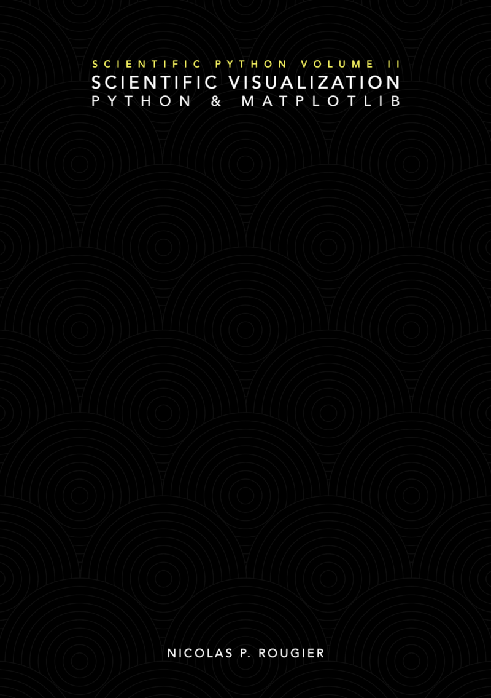
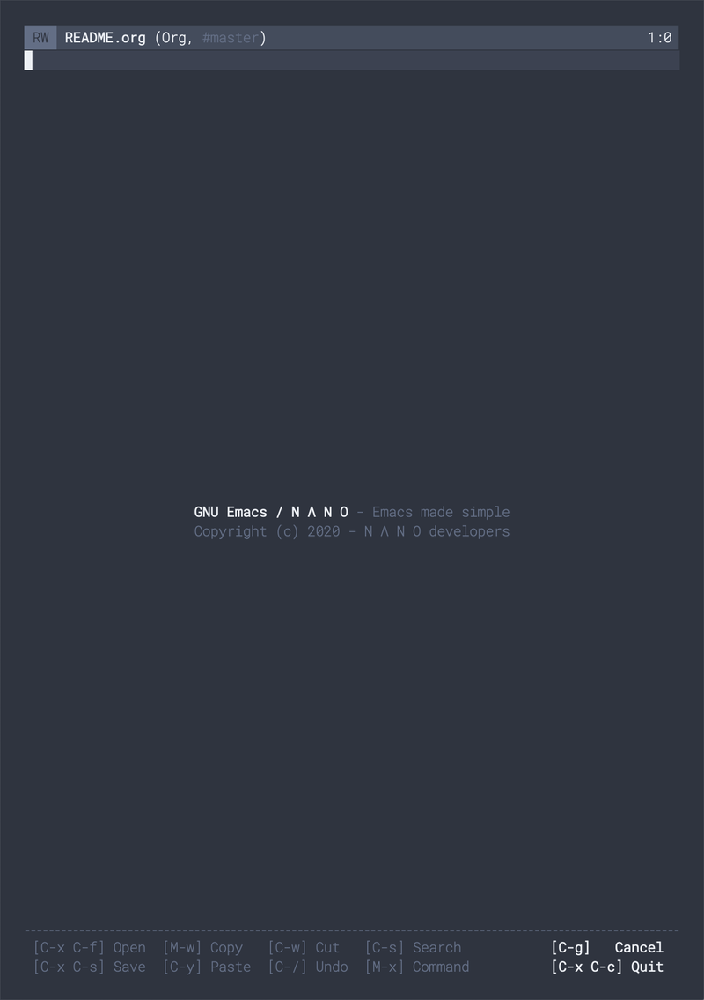
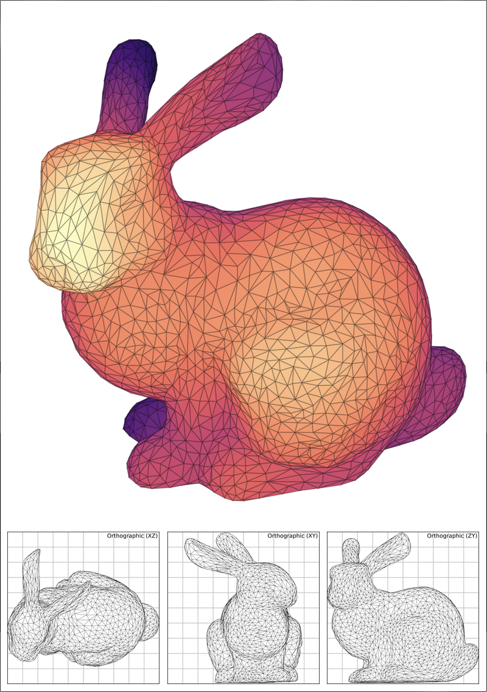
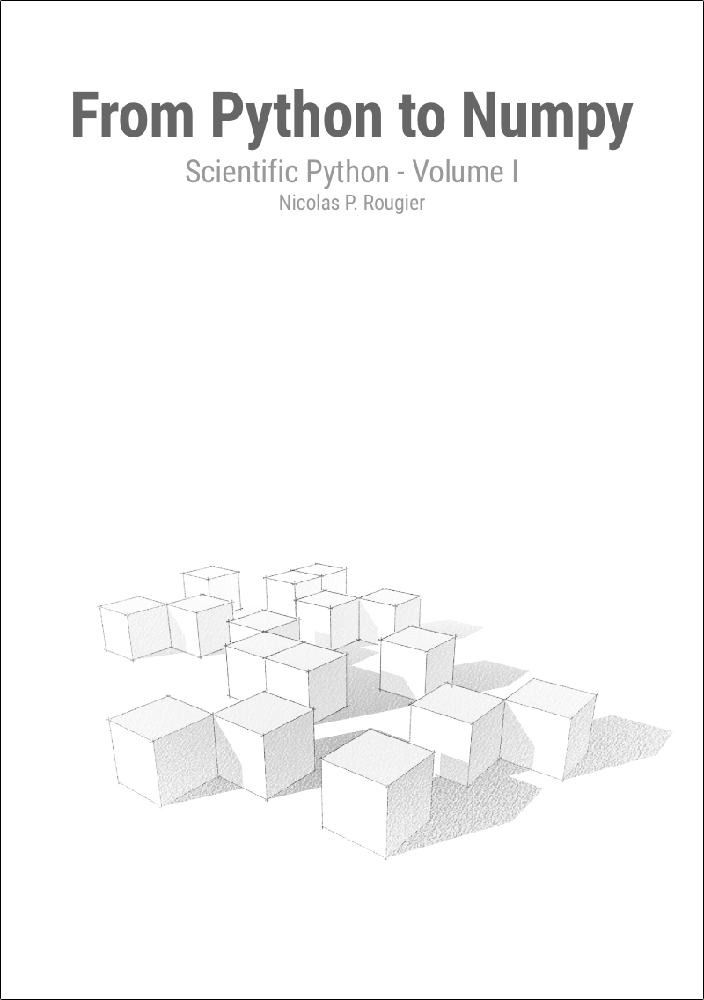

---

You can [support](https://www.paypal.me/NicolasPRougier/25) my work,
[sponsor me](https://github.com/sponsors/rougier) or [nominate me](https://stars.github.com/nominate).

---

#### Some projects

- **[Scientific Visualization: Python &
   Matplotlib](https://github.com/rougier/scientific-visualization-book)**
  is an open access book on scientific visualization using Python and
  Matplotlib.
- **[GNU Emacs / N Λ N O](https://github.com/rougier/nano-emacs)** is a
  set of configuration files for GNU Emacs such as to provide a nice and
  consistent look and feel.
- **[Matplotlib 3D](https://github.com/rougier/matplotlib-3d)** is an
  experimental project whose aim is to provide a better and more
  versatile 3d axis for Matplotlib.
- **[From Python to Numpy](https://www.labri.fr/perso/nrougier/from-python-to-numpy/)** is a open access book structured on the migration from Python to Numpy through vectorization.
