<pre align="center">
<strong>Nicolas P. Rougier /</strong> <a href="https://www.labri.fr/perso/nrougier">Homepage</a> / <a href="https://twitter.com/NPRougier">Twitter</a> / <a href="https://www.reddit.com/user/Nicolas-Rougier/submitted/?sort=top">Reddit</a> / <a href="https://github.com/rougier">GitHub</a> / <a href="https://gist.github.com/rougier">Gist</a> / <a href="https://stackoverflow.com/users/3348261/nicolas-rougier">Stack Overflow</a> / <a href="https://www.slideshare.net/NicolasRougier1">Slideshare</a> / <a href="https://www.shadertoy.com/user/rougier">Shadertoy</a></pre>

<a href="https://metrics.lecoq.io/about/rougier"></img></a>
<a href="https://metrics.lecoq.io/about/rougier"></img></a>

I’m a researcher and team leader at the Institute of
Neurodegenerative Diseases (Bordeaux, France). I’m investigating
decision making, learning and cognition using computational models
of the brain. Beside neuroscience, I’m also interested in open and
reproducible science, scientific visualization, and computer
graphics. And when I've time, I hack GNU Emacs.

 

 

### Open access books & journals

- **[ReScience C](https://rescience.github.io/)** A scientific journal dedicated to the publication of computational replications.  
- **[Scientific Visualization: Python & Matplotlib](https://github.com/rougier/scientific-visualization-book)**, an open access book on scientific visualization.   
- **[Vers une recherche reproductible (French)](https://github.com/rr-france/bookrr)** is a open access book on reproductible research practices.  
- **[From Python to Numpy](https://www.labri.fr/perso/nrougier/from-python-to-numpy/)** is a open access book on the migration from Python to Numpy through vectorization.  
- **[Python & OpenGL for Scientific Visualization](https://www.labri.fr/perso/nrougier/python-opengl/)** is an open access book on modern GL using Python.  

### Courses & tutorials
- **[100 Numpy Exercises](https://github.com/rougier/numpy-100)** is a collection of 100 numpy exercises, from easy to hard. 
- **[Computational Neuroscience course](https://github.com/rougier/CNCC-2020)** A gentle introduction to computational neuroscience in Python. 
- **[C++ Crash course](https://github.com/rougier/CPP-Crash-Course)** is an introduction to C++ for C programmers. 
- **[Matplotlib cheatsheets](https://github.com/matplotlib/cheatsheets)** are the official cheasheets (+ 2 handouts) that I designed. 
- **[Git & GitHub course](https://github.com/rougier/URFIST-git-course)** A gentle introduction to git and GitHub. 
- **[Matplotlib tutorial](https://github.com/rougier/matplotlib-tutorial)** A gentle tutorial on Matplotlib, the all-mighty visualization library. 
- **[Numpy tutorial](https://github.com/rougier/numpy-tutorial)** An introduction to Numpy for beginners. 

### Development
- **[Machine learning recipes](https://github.com/rougier/ML-Recipes)** Self-contained machine learning Python recipes. 
- **[Glumpy](https://glumpy.github.io/)** is a python library for scientific visualization that is both fast, scalable and beautiful. 
- **[VisPy](https://github.com/vispy/vispy)** is a high-performance interactive 2D/3D data visualization library. 
- **[Matplotlib 3D](https://github.com/rougier/matplotlib-3d)**  provides a better and more versatile 3d axis for Matplotlib.  
- **[Tiny 3D Renderer](https://github.com/rougier/tiny-renderer)** A soft 3D renderer in 100 lines of Python (only dependency is numpy).  
- **[Freetype Python](https://github.com/rougier/freetype-py)** provides bindings for the FreeType library (only the high-level API is bound).  
- **[Freetype GL](https://github.com/rougier/freetype-gl)** to display Unicode text in OpenGL using a single texture and a single vertex buffer.  

### Baby GNU & Tux

- **[Baby GNU & Tux](https://github.com/rougier/baby-gnu-tux)**  Original artwork

### Emacs hacking

 

- **[Emacs / N Λ N O](https://github.com/rougier/nano-emacs)** A nice and consistent look and feel for GNU Emacs, the true editor. 
- **[Elegant Emacs](https://github.com/rougier/elegant-emacs)** A very minimal but elegant emacs (I think).  
- **[SVG tag mode](https://github.com/rougier/svg-tag-mode)**  An Emacs minor mode to replace keywords or (regex) with SVG rounded box labels. 
- **[Mu4e dashboard](https://github.com/rougier/mu4e-dashboard)** allows to organise mu4e queries into a dashboard by writing a regular org file. 
- **[Mu4e thread folding](https://github.com/rougier/mu4e-thread-folding)** is a small library that enable threads folding in mu4e using overlays. 
- **[Org agenda](https://github.com/rougier/agenda)** gives an interactive view (whole year) of your agenda in the console. 
- **[Get Things Done](https://github.com/rougier/emacs-gtd)** using org mode. 

### Art... or Science

    

- **[Recursive Voronoi](https://github.com/rougier/recursive-voronoi)** Recursive voronoi using shapely, matplotlib and scipy. 
- **[Pendulum](https://github.com/rougier/pendulum)** Animated double pendulum using matplotlib.
- **[Wind map](https://github.com/rougier/windmap)** Animated streamlines using matplotlib.
- **[Alien life](https://github.com/rougier/alien-life)** A remake (using matplotlib) of the beaufitul animation by Necessary Disorder.
- **[Anatomy of a figure](https://github.com/rougier/figure-anatomy)** shows and names the main elements of a matplotlib figure.
- **[Calendar heatmap](https://github.com/rougier/calendar-heatmap)** Display your yearly GitHub activity using matplotlib.
- **[Less is More](https://github.com/rougier/less-is-more)** A remake of the animation by Darkhorse Analytics (using matplotlib, what else?).
- **[Baby GNU & baby Tux](https://github.com/rougier/baby-gnu-tux)**. Original vector and 3D models of baby GNU and baby. 3D printer ready.
- **[Open Heroes](https://github.com/rougier/open-heroes)**. Some people that facilitate science, one way or the other.

### Science

-  **[The adaptive value of probability distortion and risk-seeking (2021)](https://github.com/aureliennioche/EvoProspect)**
-  **[Randomized self organizing map (2020)](https://github.com/rougier/VSOM)**
-  **[Stability analysis of a neural field self-organizing map (2020)](https://github.com/rougier/som_stability)**
-  **[A Robust Model of Gated Working Memory (2020)](https://github.com/rougier/ESN-WM)**
-  **[Ten Years Reproducibility Challenge (2020)](https://github.com/rougier/TYRC-apple)**
-  **[A density driven method for the placement of biological cells (2018)](https://github.com/rougier/density-driven)**
-  **[A computational model of dual competition (2018)](https://github.com/rougier/one-critic-two-actors)**
-  **[Re-run, Repeat, Reproduce, Reuse, Replicate (2017)](https://github.com/rougier/random-walk)**
-  **[A parsimonious computational model of the superior colliculus (2015)](https://github.com/rougier/Superior-Colliculus)**
-  **[Ten simple rules for better figures (2014)](https://github.com/rougier/ten-rules)**
- **[Antialiased 2D Grid, Marker, and Arrow Shaders (2014)](https://github.com/rougier/JCGT-2014b)**  
- **[Shader-Based Antialiased, Dashed, Stroked Polylines (2014)](https://github.com/rougier/JCGT-2014a)**  
- **[Higher Quality 2D Text Rendering (2013)](https://github.com/rougier/JCGT-2013)**  
-  **[Distributed numerical and adaptive modelling framework (2012)](https://github.com/rougier/dana)**
-  **[Dynamic self-organising map (2011)](https://github.com/rougier/dynamic-som)**
-  **[Activity spread and breathers in two-dimensional neural fields (2010)](https://github.com/rougier/delayed-neural-field)**

